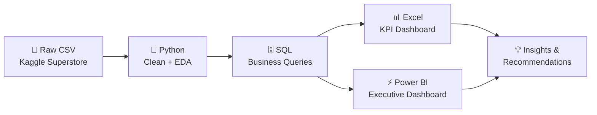
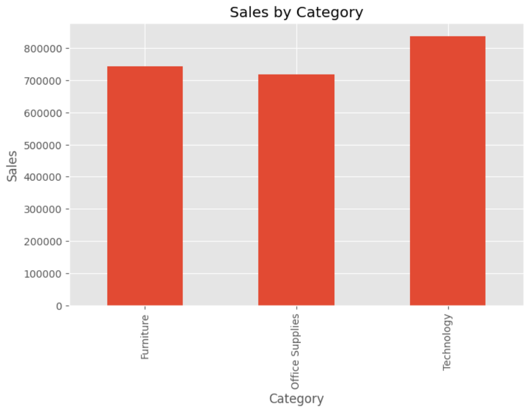
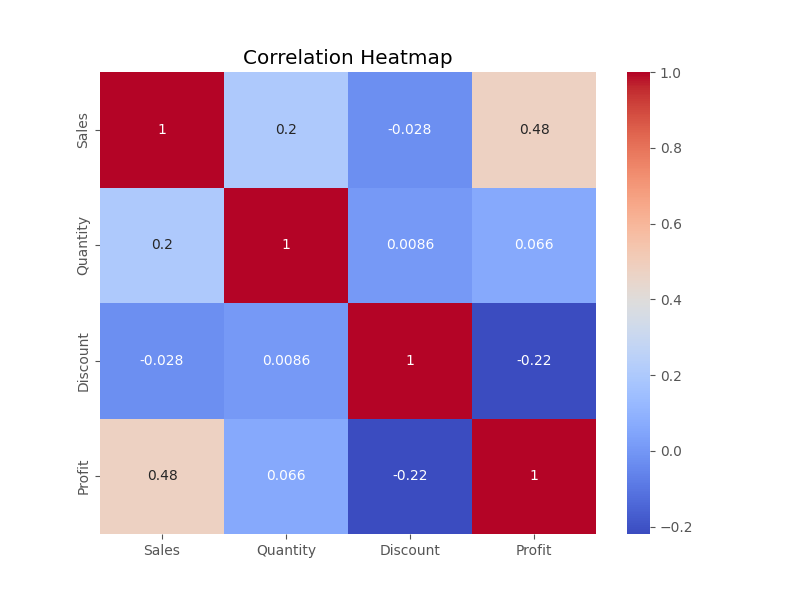
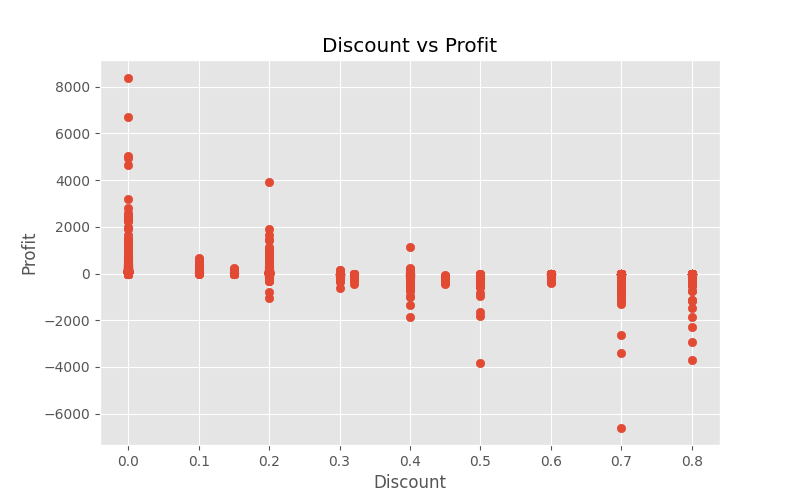
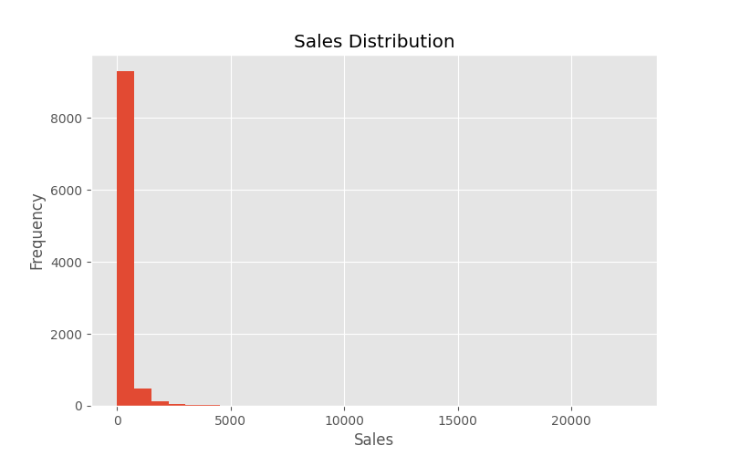
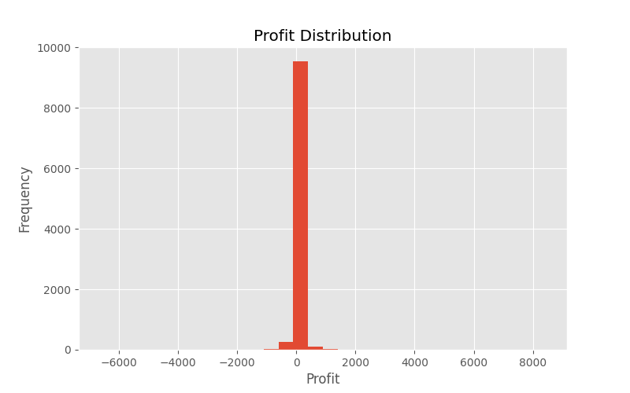
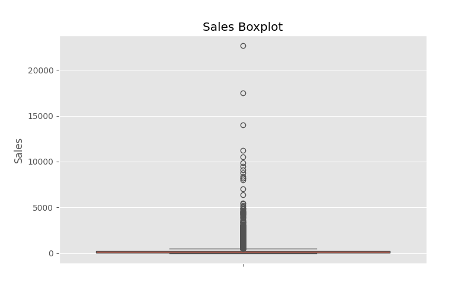
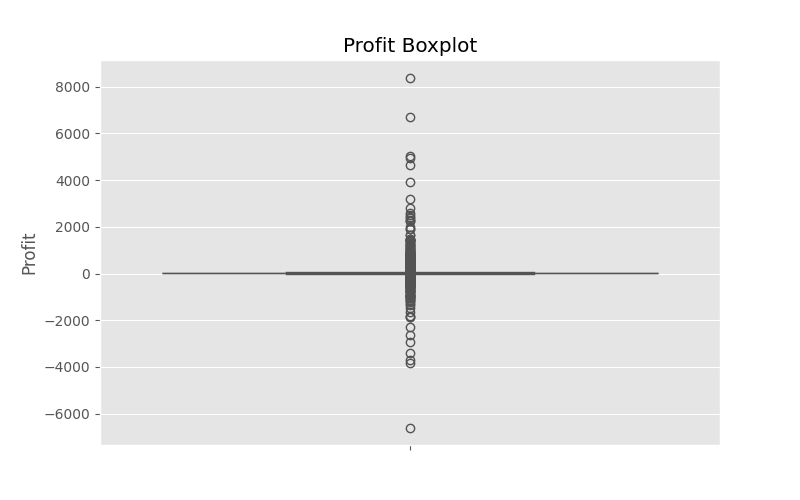
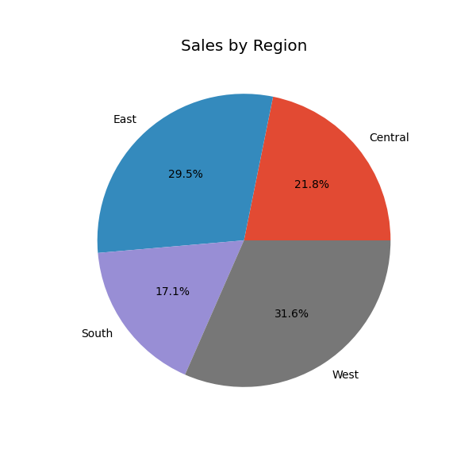
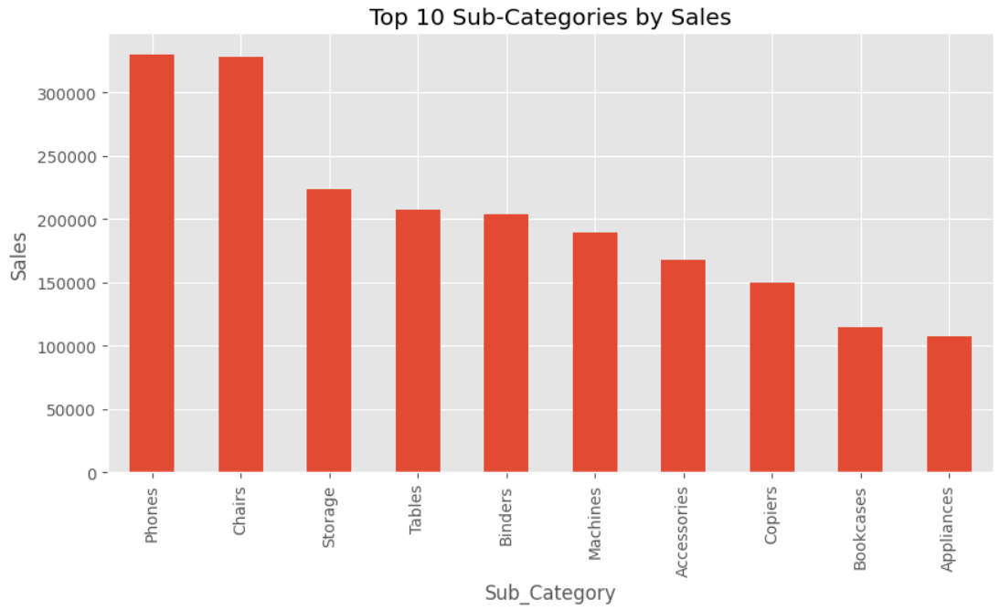

<div align="center">

# 🛒 E-Commerce Customer & Marketing Analytics

### End-to-End Analysis using **SQL · Python · Excel · Power BI**

*Turning raw transactions into revenue-protecting decisions.*

[](https://www.python.org/)
[](#-sql-analysis)
[](#-excel-dashboard)
[](#-power-bi-dashboard)
[](#-license)


</div>

<br>

> **TL;DR** — Superstore's sales are healthy, but **1 in 5 orders lose money**. This project traces that leak from raw CSV → Python cleaning → SQL queries → Excel & Power BI dashboards, and pins the cause on uncontrolled discounting and a handful of loss-making sub-categories — then quantifies exactly what to fix.

<br>

## 📌 Table of Contents

- [Overview](#-overview)
- [Key Results at a Glance](#-key-results-at-a-glance)
- [Tech Stack](#-tech-stack)
- [Project Workflow](#-project-workflow)
- [Dataset](#-dataset)
- [Python — Data Cleaning & EDA](#-python--data-cleaning--eda)
- [SQL Analysis](#-sql-analysis)
- [Excel Dashboard](#-excel-dashboard)
- [Power BI Dashboard](#-power-bi-dashboard)
- [Key Insights](#-key-insights)
- [Recommendations](#-recommendations)
- [Repository Structure](#-repository-structure)
- [How to Reproduce](#-how-to-reproduce)
- [Future Enhancements](#-future-enhancements)
- [Author](#-author)
- [License](#-license)

<br>

## 🧭 Overview

Superstore sells **Furniture, Office Supplies & Technology** across four U.S. regions. Order volume keeps growing — but profit hasn't kept pace. This project builds a complete, cross-validated analytics pipeline to answer one question:

> **Where exactly is profit being made — and where is it leaking?**

| | |
|---|---|
| 🎯 **Goal** | Find and quantify the drivers of profitability, then convert findings into prioritized business actions |
| 🗃️ **Source** | [Kaggle — Sample Superstore Dataset](https://www.kaggle.com/datasets/vivek468/superstore-dataset-final) |
| 🔬 **Method** | Python (clean + EDA) → SQL (query) → Excel (KPI dashboard) → Power BI (executive dashboard) |
| 📦 **Deliverables** | Cleaned dataset, EDA notebook, SQL query bank, `.xlsx` dashboard, `.pbix` dashboard, full report & slide deck |

<br>

## ⚡ Key Results at a Glance

<div align="center">

| 💰 Total Sales | 📈 Total Profit | 🧾 Orders | 📦 Units Sold |
|:---:|:---:|:---:|:---:|
| **₹22,96,195.59** | **₹2,86,241.42** | **9,977** | **37,820** |

| 🎯 Profit Margin | 🏷️ Avg. Discount | ⚠️ Orders Sold at a Loss | 🔗 Discount ↔ Profit Correlation |
|:---:|:---:|:---:|:---:|
| **12.0 – 12.5%** | **15.63%** | **18.73%** | **−0.22** |

</div>

<br>

## 🛠 Tech Stack

<div align="center">


</div>

<br>

## 🔄 Project Workflow



Each stage **cross-validates** the last — the correlation seen in Python's EDA reappears in SQL aggregates, and both are visualized consistently across Excel and Power BI, giving high confidence in the final recommendations.

<br>

## 🗃 Dataset

<details>
<summary><b>Click to expand dataset schema</b></summary>
<br>

| Field | Type | Description |
|---|---|---|
| `Order ID`, `Order Date`, `Ship Date`, `Ship Mode` | Text / Date / Categorical | Order & fulfillment metadata |
| `Customer ID`, `Customer Name`, `Segment` | Text / Categorical | Consumer, Corporate, Home Office |
| `Country`, `City`, `State`, `Region` | Categorical | Central, East, South, West |
| `Category`, `Sub-Category`, `Product Name` | Categorical / Text | Furniture, Office Supplies, Technology |
| `Sales`, `Quantity`, `Discount`, `Profit` | Numeric | Core metrics used throughout this analysis |

**9,977** order lines · **37,820** units · multi-year U.S. retail transactions.

</details>

<br>

## 🐍 Python — Data Cleaning & EDA

**Cleaning steps:** removed duplicates → fixed data types → parsed dates → validated `Discount` range (0–80%) → reviewed `Profit` outliers → engineered `Profit Margin` and a loss-order flag.

<table>
<tr>
<td width="50%"></td>
<td width="50%"></td>
</tr>
<tr>
<td width="50%"></td>
<td width="50%"></td>
</tr>
</table>

<details>
<summary><b>📊 More EDA charts (distributions, outliers, regional split, Pareto)</b></summary>
<br>
<table>
<tr>
<td width="50%"></td>
<td width="50%"></td>
</tr>
<tr>
<td width="50%"></td>
<td width="50%"></td>
</tr>
<tr>
<td width="50%"></td>
<td width="50%"></td>
</tr>
</table>
</details>

> 🔑 **Headline finding:** `Sales ↔ Profit` correlate at **+0.48**, but `Discount ↔ Profit` correlate at **−0.22** — discounting is the clearest controllable drag on margin in the entire dataset.

<br>

## 🗄 SQL Analysis

Business questions answered with precise, ad-hoc SQL aggregation. Sample query:

```sql
-- Top 10 loss-making sub-categories
SELECT Sub_Category,
       SUM(Sales)  AS Total_Sales,
       SUM(Profit) AS Total_Profit
FROM superstore
GROUP BY Sub_Category
HAVING SUM(Profit) < 0
ORDER BY Total_Profit ASC
LIMIT 10;
```

| Query | Business Question |
|---|---|
| Sales, Profit & Margin by Category | Which category drives the most revenue *and* profit? |
| Top 10 Loss-Making Sub-Categories | Which sub-categories are eroding profitability? |
| Regional Performance | Is regional sales volume a good proxy for profit? |
| Discount Band Analysis | At what discount level does the average order stop being profitable? |
| Loss-Order Rate | What share of orders are unprofitable, and what does it cost? |

*(Full query bank in [`/SQL`](./SQL).)*

<br>

## 📗 Excel Dashboard

PivotTable / PivotChart based KPI dashboard, filterable by Category, Region & Segment.

<p align="center">

</p>

<br>

## ⚡ Power BI Dashboard

A **5-page interactive report**, filterable by Region, Category, Segment & Ship Mode.

<details open>
<summary><b>1️⃣ Executive Dashboard</b> — top-line KPIs, regional map, category & segment mix</summary>
<p align="center"></p>
</details>

<details>
<summary><b>2️⃣ Sales Analysis</b> — sales by category, sub-category & top 10 states</summary>
<p align="center"></p>
</details>

<details>
<summary><b>3️⃣ Profit Analysis</b> — profit by region/category/segment & loss-making sub-categories</summary>
<p align="center"></p>
</details>

<details>
<summary><b>4️⃣ Discount Analysis</b> — discount vs profit, discount distribution & avg. discount by category</summary>
<p align="center"></p>
</details>

<details>
<summary><b>5️⃣ Business Recommendations</b> — key findings mapped directly to action items</summary>
<p align="center"></p>
</details>

<br>

## 💡 Key Insights

- 🚀 **Technology drives profit** — 50.8% of total profit, and the lowest average discount of any category.
- 📉 **Furniture underperforms** — nearly matches Technology on sales but earns only ~6% of total profit.
- 🌎 **West & East lead** — together contribute 60%+ of sales and ~200K of total profit.
- 👥 **Consumer segment dominates** — 49.5% of total profit, nearly half of the business.
- 🏷️ **Discounting erodes margin** — correlation of **−0.22**; profit turns negative past ~20–30% discount.
- ⚠️ **18.73% of orders lose money** — a quantifiable, addressable drag on the bottom line.
- 📦 **3 sub-categories bleed profit** — Binders (−31K), Tables (−21K), Machines (−19K).
- 🚚 **Standard Class dominates fulfillment** — 59.1% of all shipments.

<br>

## ✅ Recommendations

1. **Tighten discount governance** — cap or require approval above 20–30% discount.
2. **Review pricing** on Binders, Tables, Machines & other loss-making sub-categories.
3. **Re-balance Furniture's discounting** — reduce blanket discounts; use bundling instead.
4. **Double down on Technology & Office Supplies** — weight investment toward proven margin.
5. **Sustain West & East investment**, investigate Central & South underperformance.
6. **Deepen Consumer segment engagement** through loyalty & retention programs.
7. **Track the loss-order rate** as a recurring KPI — target a measurable reduction from 18.73%.

<br>

## 📁 Repository Structure

```
📦 ecommerce-customer-marketing-analytics
├── 📂 Dataset/               # Raw & cleaned Superstore dataset
├── 📂 Python/                # Python cleaning + EDA notebooks
├── 📂 SQL/                   # Business-question SQL query bank
├── 📂 Excel/                 # Excel KPI dashboard (.xlsx)
├── 📂 PowerBI/               # Power BI dashboard (.pbix)
├── 📂 Report/                # Full written report (.docx)
├── 📂 Prresentation/         # slide deck (.pptx)
├── 📂 Images/                # Charts & dashboard screenshots used in this README
└── 📄 README.md
```

<br>

## 🚀 How to Reproduce

```bash
# 1. Clone the repo
git clone https://github.com/gokum1130/E-Commerce-Customer-Marketing-Analytics-End-to-End-Analysis-using-SQL-Python-Excel-Power-BI.git
cd E-Commerce-Customer-Marketing-Analytics-End-to-End-Analysis-using-SQL-Python-Excel-Power-BI

# 2. Run cleaning & EDA
jupyter notebook Python/Cleaning.ipynb
jupyter notebook Python/Exploratory_Data_Analysis_(EDA).ipynb
# 4. Load into your SQL database of choice and run queries in /SQL

# 5. Open the dashboards
#    Excel/Dashboard%20Along%20with%20Pivot%20Tables%20%26Pivot%20Charts.xlsx
#    PowerBI/Dashboard.pbix
```

<br>

## 🔮 Future Enhancements

- 📈 Sales & profit **forecasting** (Prophet / ARIMA) by category & region
- 🧩 **Customer segmentation** (RFM / clustering) for targeted marketing
- 💲 **Discount-optimization** model with sub-category-level elasticity
- ⚙️ **Automated ETL** pipeline (Python → SQL → Power BI, scheduled refresh)
- 🔍 **Drill-through** reporting to product & customer level
- 🌐 **External data enrichment** — marketing spend, competitor pricing, macro indicators

<br>

## 👤 Author - Govind

**E-Commerce Customer & Marketing Analytics** — built as an end-to-end analytics portfolio project.

[](https://github.com/gokum1130)
[](https://www.linkedin.com/in/govind1130/)

<br>

## 📄 License

This project is licensed under the **MIT License** — see [`LICENSE`](./LICENSE) for details.

The dataset is sourced from Kaggle's [Sample Superstore Dataset](https://www.kaggle.com/datasets/vivek468/superstore-dataset-final) and used for educational/portfolio purposes.

<br>

<div align="center">

⭐ **If this project was useful, consider giving it a star!** ⭐

</div>
